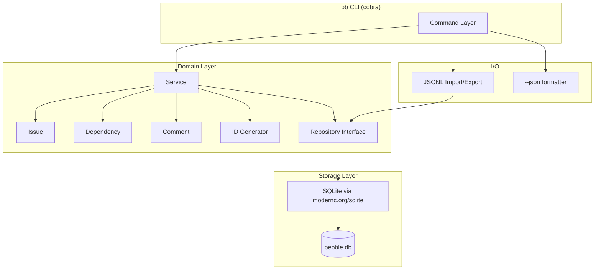

# Pebble (pb)

## Problem

[Beads](https://github.com/steveyegge/beads) is a powerful issue tracker that grew to serve multi-agent orchestration. For a solo developer that likes to keep their hands on the wheel while pairing with an AI navigator, ~80% of it is dead weight.

Pebble keeps the genuinely good ideas — hash-based IDs, `ready` as a first-class concept, `--json` on everything, dependency DAG, defer/due dates — and drops everything else.

## Solution

Hash-based IDs, `ready` view, dependency DAG, `--json` everywhere — in a single binary backed by SQLite

## Architecture



## Usage

```text
pb init [--stealth] [--prefix]      pb ready [--sort --limit]
pb create "title" [flags]           pb upcoming [--days --assignee]
pb show <id>                        pb search <query>
pb update <id> [flags]              pb dep add <id> --blocks <id>
pb close <id>                       pb dep remove <id> <id>
pb reopen <id>                      pb comment <id> "text"
pb delete <id>                      pb stale [--days]
pb list [--status --type ...]       pb config set|get|list
pb export [-o file.jsonl]           pb version
pb import <file.jsonl>
```