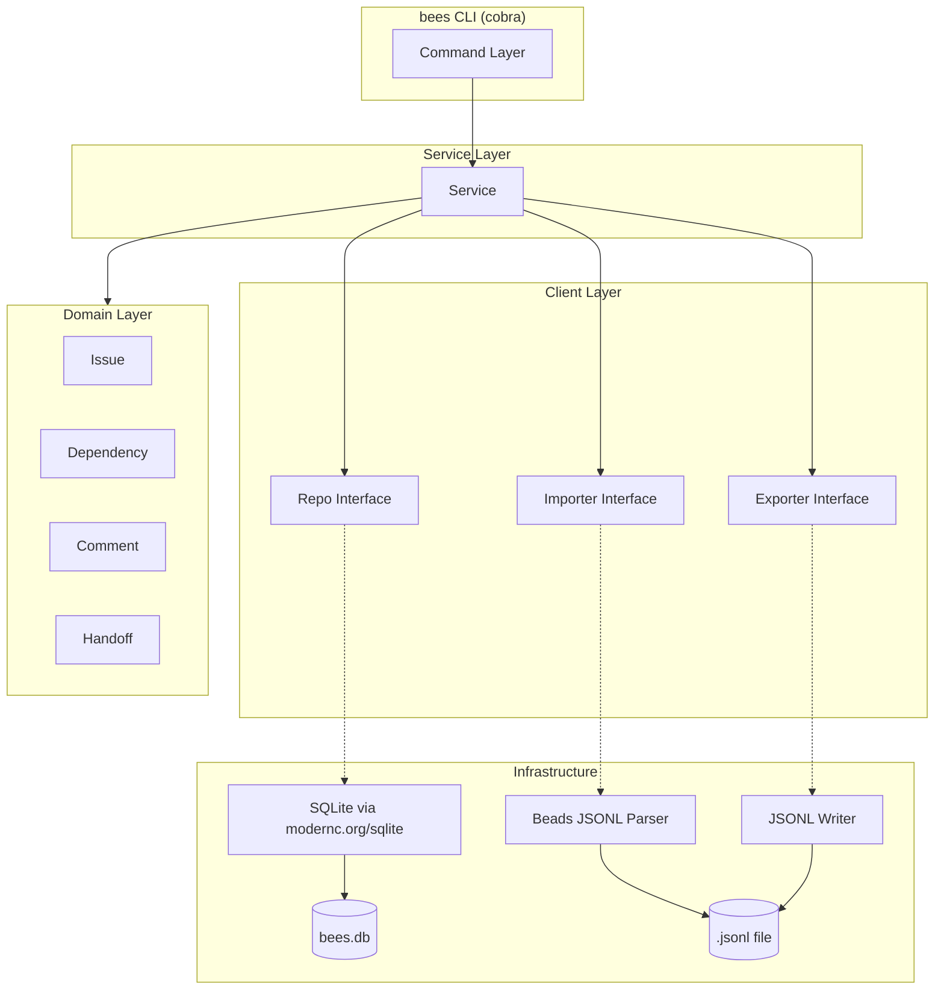
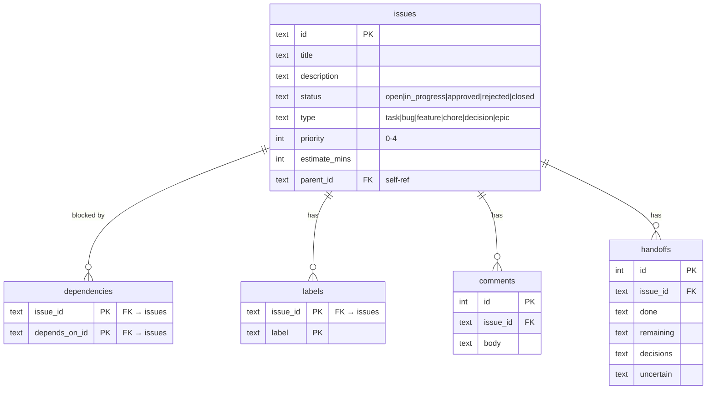

# bees

<div align="center">
  
</div>

An alternative to a sea of .md files for developers who pair with agentic navigators.

## Storage model

bees has two storage modes. v1 keeps a store per repo. v2 keeps one store per device. Which one you have depends on your installed binary.

**v1 (per-repo).** Each repo gets its own `.bees/bees.db`. `bees init` creates it. bees finds it by walking up the directory tree. Config and the issue prefix live in that repo's `.bees/config.yaml`. So outside an initialized repo, bees has nothing to work with.

**v2 (one store per device).** There is one store at `~/.bees/bees.db`. Set `BEES_HOME` to put it somewhere else. The store is created automatically on first use. It is reachable from any directory. There is no `bees init`, no `.bees/` directory, and no `--stealth`. You set the issue prefix per command with `--prefix` or the `BEES_PREFIX` environment variable.

## Install

`@latest` installs the newest release. To stay on v1, pin `v1.31.1`.

**v1 (per-repo):**

```sh
go install github.com/w-h-a/bees/cmd/bees@v1.31.1
```

**v2 (device-global):**

```sh
go install github.com/w-h-a/bees/cmd/bees@latest
```

## Quick Start

**v1 (per-repo):**

```sh
bees init --prefix PROJ   # creates .bees/bees.db in the current repo
bees create "Design auth flow" --type task --priority 2
```

**v2 (device-global):**

```sh
# no init, the store at ~/.bees auto-creates on first use
bees create "Design auth flow" --type task --priority 2 --prefix PROJ
```

**Either version:**

```sh
bees list --status open
bees update PROJ-xxx --assignee me
bees ready
```

## Commands

Most commands are the same in both versions:

```text
bees create "title" [flags]
bees show <id>
bees update <id> [flags]
bees close <id>
bees reopen <id>
bees list [--status --type ...]
bees search <query>
bees delete [--closed-before --yes]
bees dep add <id> --blocks <id>
bees dep remove <id> <id>
bees dep graph [<id>]
bees comment <id> "text"
bees handoff <id> [--done --remaining ...]
bees import <file.jsonl>
bees export [-o file.jsonl]
bees context
bees ready [--sort --limit]
bees upcoming [--days --assignee]
bees version
```

v1 only:

```text
bees init [--stealth] [--prefix]
bees config set|get|list
```

v2 only:

```text
bees migrate <repo>... [--commit]
bees create --prefix <prefix>
```

## Migrating from v1 to v2

`bees migrate` copies a repo's v1 store into the v2 device store. It reads the repo's `.bees/bees.db` and writes those issues into `~/.bees/bees.db`. It never touches the source. So your old per-repo stores stay as a fallback.

```sh
# dry run, shows what each repo would import
bees migrate ~/repos/project-a ~/repos/project-b

# write the import
bees migrate ~/repos/project-a --commit
```

The dry run is the default. It reports what each source would add and names any ID collisions. Add `--commit` to write. Re-running with `--commit` is safe. It skips issues already in the device store. So a partial migration can resume.

## Architecture

### Flowchart


```mermaid
graph TD
  subgraph CLI ["bees CLI (cobra)"]
    CMD[Command Layer]
  end

  subgraph Service ["Service Layer"]
    SVC[Service]
  end

  subgraph Client ["Client Layer"]
    REPO_IF[Repo Interface]
    IMP_IF[Importer Interface]
    EXP_IF[Exporter Interface]
  end

  subgraph Infra ["Infrastructure"]
    SQLITE[SQLite via modernc.org/sqlite]
    DB[(bees.db)]
    BEADS[Beads JSONL Parser]
    JSONW[JSONL Writer]
    JSONL[(.jsonl file)]
  end

  subgraph Domain ["Domain Layer"]
    ISSUE[Issue]
    DEP[Dependency]
    COMMENT[Comment]
    HANDOFF[Handoff]
  end

  CMD --> SVC
  SVC --> Domain
  SVC --> REPO_IF
  SVC --> IMP_IF
  SVC --> EXP_IF
  REPO_IF -.-> SQLITE
  SQLITE --> DB
  IMP_IF -.-> BEADS
  BEADS --> JSONL
  EXP_IF -.-> JSONW
  JSONW --> JSONL
```

### ER Diagram


```mermaid
erDiagram
  issues {
    text id PK
    text title
    text description
    text status "open|in_progress|approved|rejected|closed"
    text type "task|bug|feature|chore|decision|epic"
    int priority "0-4"
    int estimate_mins
    text parent_id FK "self-ref"
  }

  dependencies {
    text issue_id PK "FK → issues"
    text depends_on_id PK "FK → issues"
  }

  labels {
    text issue_id PK "FK → issues"
    text label PK
  }

  comments {
    int id PK
    text issue_id FK
    text body
  }

  handoffs {
    int id PK
    text issue_id FK
    text done
    text remaining
    text decisions
    text uncertain
  }

  issues ||--o{ dependencies : "blocked by"
  issues ||--o{ labels : has
  issues ||--o{ comments : has
  issues ||--o{ handoffs : has
```
